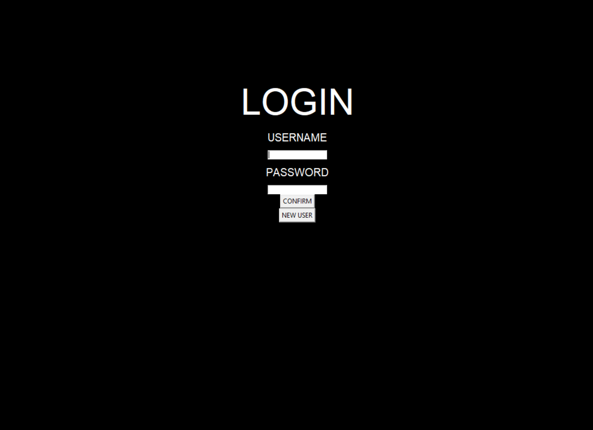
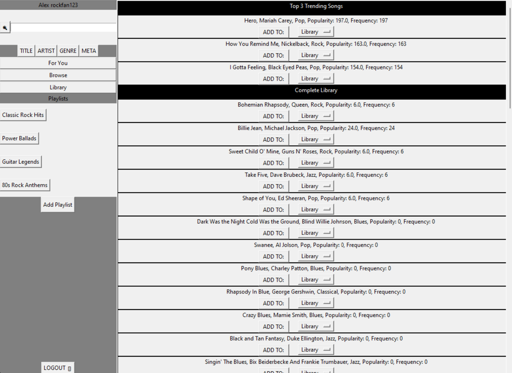
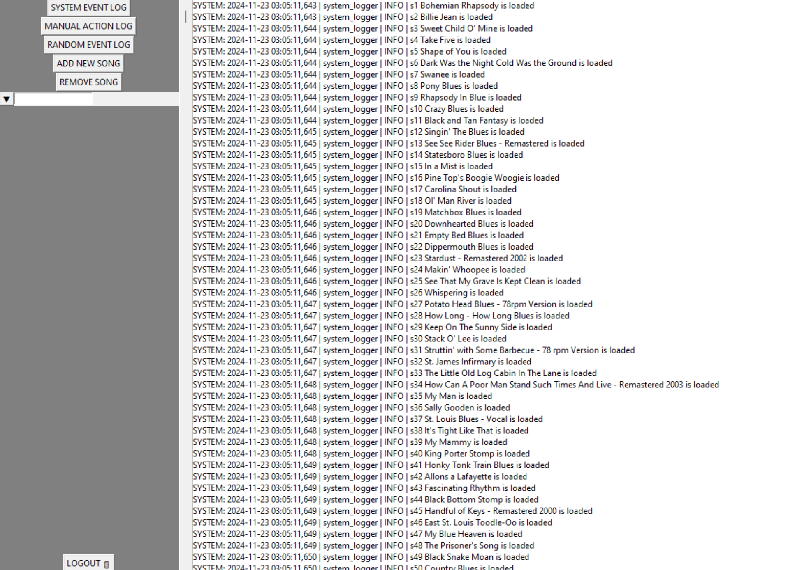

# User Documentation

## Description

### Overview

This Python Music Player System is a mock music player with a graphical user interface that provides basic functionalities as well as advanced suggestions, using the linked-list data structure. 

In this music player system, there is a user database and a song database, with functionalities such as a use login system, admin system, library and playlist system, search function, and adding and removing songs. This system also includes advanced functionalities such as a machine learning suggestion algorithm, trend analysis, and fuzzy matching.

Since this is a mock system, there are also comprehensive and advanced testing functionality, random event generation, and specific logs with filtering features.

### Development

Our Music Player project will be coded using Python with the Tkinter library to create a graphical user interface. We will be coding together during classes with the VS Code Live Share which allows people to collaborate in real time with one project. After we are done with each class, we will commit our changes to GitHub. As the project develops, we might split into different branches and work on separate features. We will complete our planning, track our progress, and save and commit code on GitHub. GitHub will be the centre of our project, with a repository to store code and track commits, and a Project to plan and schedule.

## Installation

### Prerequisites

- **Operating System**: Works best on Windows, also supports MacOS
- **Python**: Version 3.12.4 or higher

### Dependencies

- **pip**: Package installer
- **Tkinter**: Python graphical user interface
- **Scikit Learn**: Machine learning library
- **Numpy**: Mathematics Library

### Install

1. Clone the GitHub Repository by running the following command:

```bash
git clone https://github.com/yifanluo2006/music-player-python.git
```

2. Install dependencies by running the following commands:

```bash
python -m pip install --upgrade pip
pip install numpy scikit-learn tk
```

## Usage

To run the music player system, follow the following steps:

1. cd into the directory containing the project

```bash
cd /music-player-python
```

2. Run the project in Main, specifically the main.py file, with this command:

```bash
python main.py
```

Alternatively, you can also install VS Code as an IDE and clone the repository and run the main.py file from there.

## Features

### Login



The login screen consists of a text box to username and a textbox to input the password. Once a correct username and password is imported, press confirm to login.
If you wish to create a new user, simply press the new user button and a window will appear below prompting you to create a new profile. Put in the desired username and password and a new user is created, which can be logged in right after with the original login screen.

### User Interface



On the left side, there is a bar that displays the searching, section tabs, playlists, and various other functions. On the right side, the individual songs are displayed

On top of the left side is the use name. Below is the search bar, simply type in a query and we will find the best match through fuzzy logic. Your query can be matched with title, artist, genre, or meta data. There is also a search history available with search

The For You tab is a recommendation based on your specific taste for music.

The browse tab displays the most popular and trending songs as well as all the songs in this music player system.

The library displays the song that you own, including all songs in your playlists.

Under playlsts, are all your playlists. You can add a new playlist by pressing the Add Playlist button which will prompt you to add a new playlist.

On the right side, you can add a song to a library/playlist, by selecting the library/playlist on the drop down menu and clicking ADD TO:

### Admin Interface



By inputting admin as the username, and adminpassword as the password, you are able to login as an administrator.

As an administrator, you are able to check system, manual, and random event logs, with advanced filtering tools to filter the desired types of logs. The filtering tool is similar to a search function, that can find the required type of log.

The administrator can also add a new song to the system or remove a song from the system. To do this, simply press these buttons and follow the prompts and instructions.

## Credits

This project is a collaboration between Yifan and Jaden, with Yifan working on backend functionality and Jaden working on GUI.

## Tests

The tests are stored in the tests directory, and automated testing is integrated each time the code is pushed to Github.
